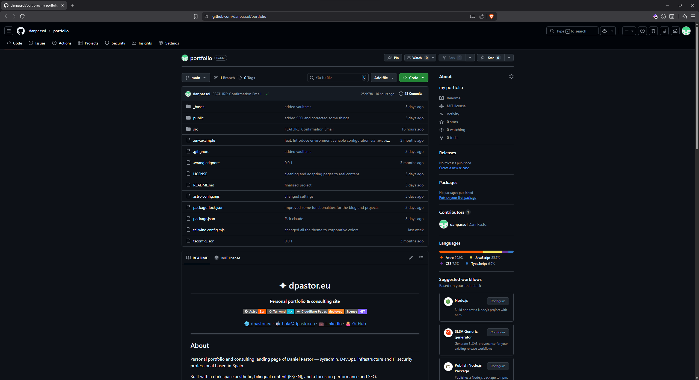
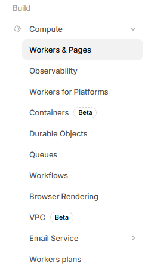
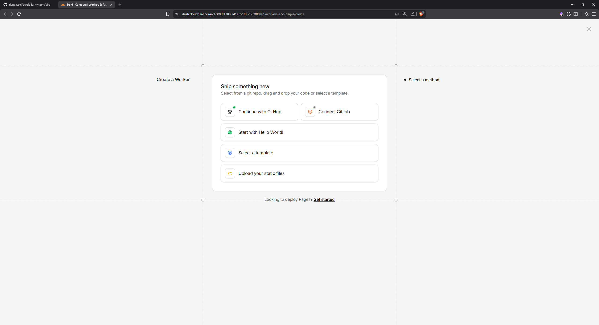
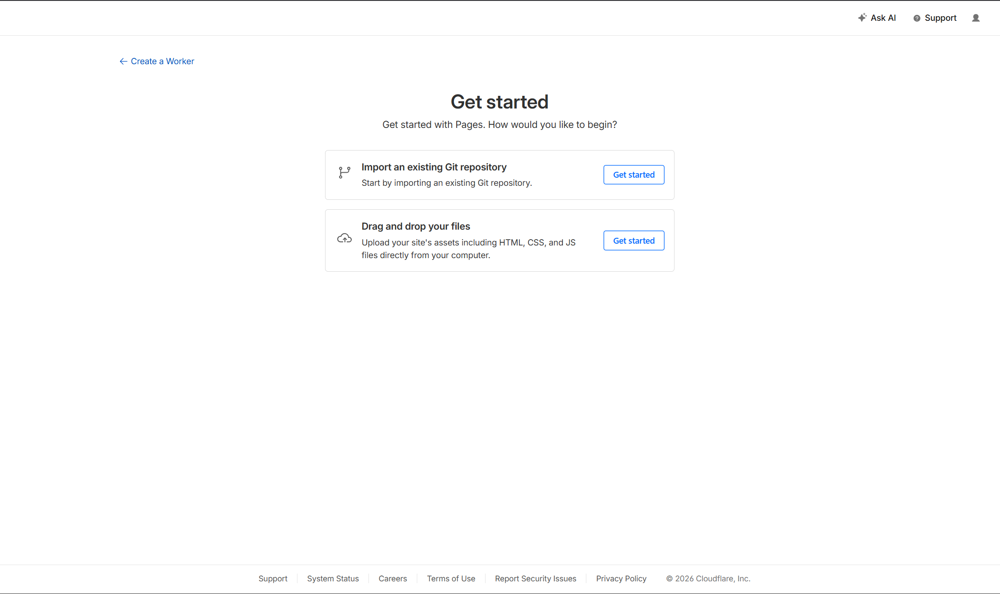
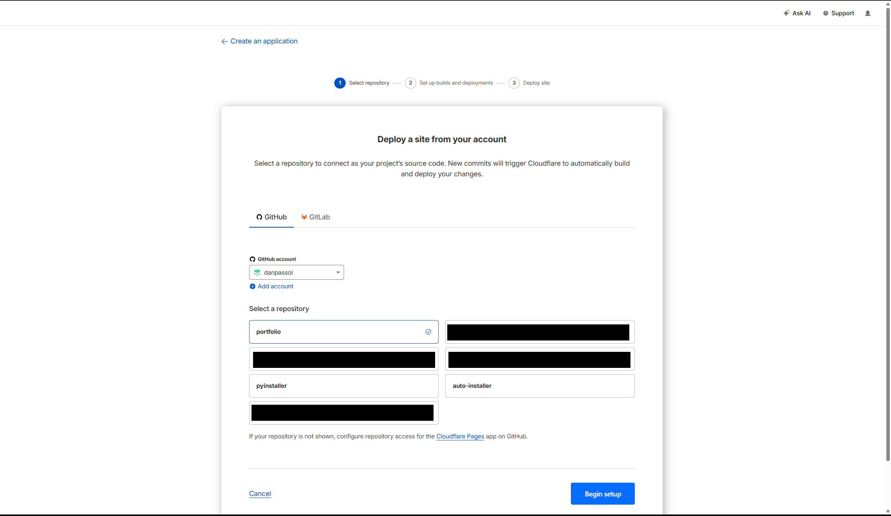
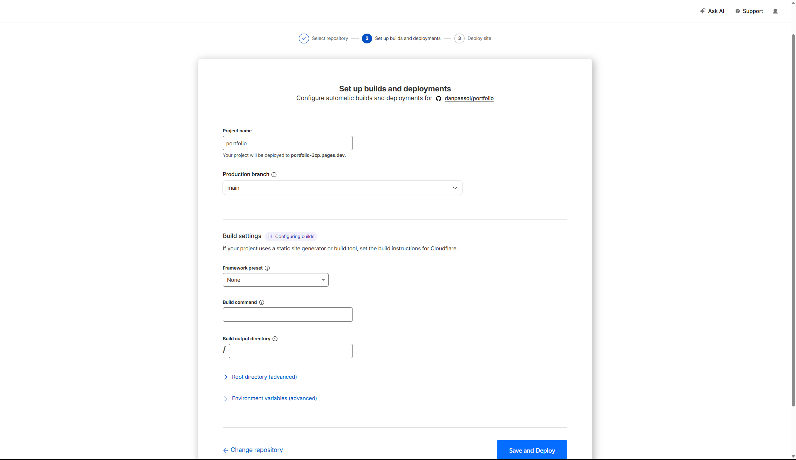
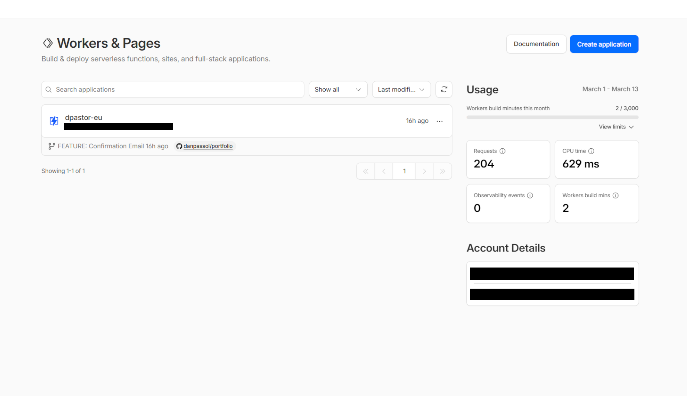
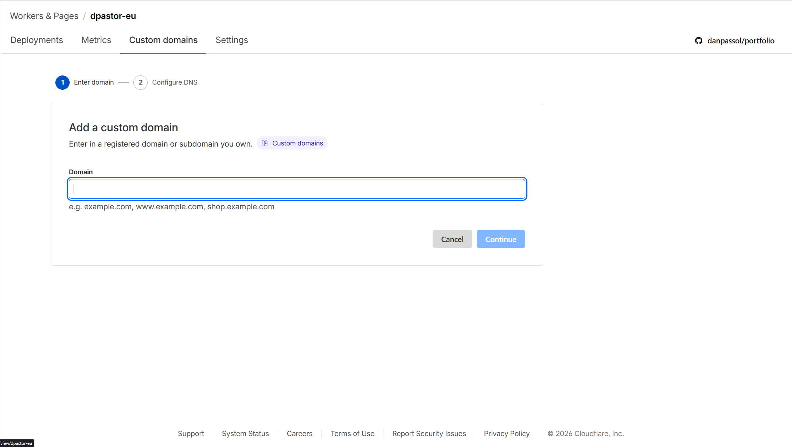

En este blog voy a hablar sobre cómo pasar de una web o servicio en entorno de desarrollo a producción. Lo primero de todo es entender qué es producción.

## ¿Qué es producción?
Llamamos entorno de producción al servidor que se va a encargar de publicar nuestra web o servicio de cara a internet, dejando de estar en un entorno de desarrollo o "fase de pruebas".

## ¿Qué necesito para desplegar?
Se puede desplegar de muchas maneras: sobre infraestructura propia expuesta a internet, usando un VPS (servidor privado) en alguna nube como AWS o Azure, o con servicios como Vercel o Cloudflare Pages.
Lo que sí o sí necesitas será:
- Un dominio ( midominio.net, .com entre otros) comprado y disponible para su uso
- Una aplicación o servicio para desplegar
- Un repositorio en GitHub/GitLab

## ¿Web estática o dinámica?
Es muy importante saber qué tipo de web vamos a desplegar, ya que esto influye en cómo vamos a pasarla a producción. Hay dos tipos de webs: las estáticas, donde se muestra un contenido fijo que no cambia en tiempo real, como un portfolio o un blog; y las dinámicas, como un dashboard con métricas o una aplicación web, que actualizan el contenido sin que el cliente recargue la página.

## Desplegando una página estática
Para este post, vamos a desplegar un portfolio (página estática) usando una pipeline, que en este caso será Cloudflare.

### ¿Qué es una pipeline?
Una pipeline o "cadena de montaje" es el mecanismo que se encarga de coger todos los datos de nuestra app, ponerlos en un servidor online y desplegarlos de forma automática, sin que tengamos que hacer prácticamente nada a mano.

> [!note] Nota
> Hablaré de pipelines como "Jenkins" o "GitHub Actions" en un próximo post, donde desplegaremos una aplicación en infraestructura propia.

## Inicio del despliegue
Bien, una vez entendidos los conceptos y sabiendo que vamos a desplegar una página estática, vamos a comenzar.
Lo primero será tener el código de nuestra aplicación en un repositorio, ya sea GitHub o GitLab, para tener control de versiones y poder volver a una versión anterior en caso de cualquier fallo.

Como podemos ver, yo tengo ya el proyecto en GitHub. Ahora nos dirigiremos al [dashboard de Cloudflare](https://dash.cloudflare.com) e iniciaremos sesión con nuestra cuenta. Es importante tener nuestro dominio asociado a Cloudflare (o comprado con ellos) para poder usar correctamente el servicio de Pages.

En el panel principal, a la izquierda, veremos todas las opciones disponibles. Pulsaremos en **Compute** y dentro en **Workers & Pages**, como se indica en la imagen.

Una vez dentro, si es la primera vez que entramos, nos aparecerá un diálogo para desplegar un worker, pidiéndonos que iniciemos sesión con GitHub o GitLab:

Esto es para desplegar un worker. En nuestro caso queremos Pages, así que pulsamos en "Looking to deploy pages? Get started".

Ahora nos pedirá conectar un repositorio o subir los archivos de nuestra web. Siempre recomiendo tener todo en un repositorio para aprovechar el control de versiones y automatizar los despliegues.

Una vez pulsemos en **Get started** sobre el repositorio git, nos mostrará una ventana para seleccionar el repositorio a desplegar. Aparecerán tanto los repositorios públicos como privados de nuestra cuenta de GitHub/GitLab.

Pulsamos en siguiente y nos pedirá configuraciones como el nombre del proyecto, la rama de desarrollo o las variables de entorno.

¡Y una vez pulsemos en **Save and Deploy**, Cloudflare desplegará nuestra página!

### Asociar la página a un dominio
Tenemos la página desplegada, pero no asociada a nuestro dominio. Para ello, si volvemos a Workers & Pages en el dashboard, veremos nuestro nuevo sitio.

Pulsamos sobre él y vamos al apartado de **Custom domains**, donde tendremos que añadir nuestro dominio previamente registrado con Cloudflare.

Y una vez añadido, ya tendremos nuestra página en producción y asociada a nuestro dominio.