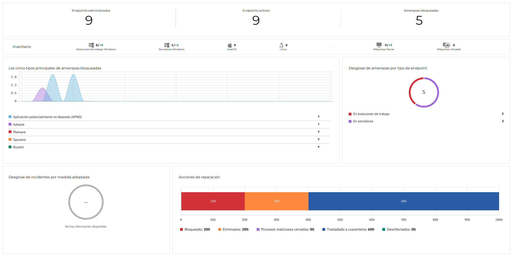

>[!caution] Disclaimer
>
Este post utiliza nombres ficticios, endpoints simulados y capturas recreadas para preservar la privacidad y seguridad del cliente.

El cliente que recientemente me contactó es propietario de una farmacia donde tiene varios equipos expuestos a Internet, incluyendo servidores y terminales TPV. Inicialmente <b>buscaban instalar un antivirus tradicional</b>, pero tras analizar la infraestructura y los riesgos reales del entorno, este se quedaba corto, por lo que opté por desplegar una <b>solución EDR</b> para mejorar la monitorización y respuesta ante amenazas.

## ¿Qué es un EDR?

 Un <b>EDR (Endpoint Detection and Response)</b> es una solución de seguridad diseñada para monitorizar, detectar y responder ante amenazas en dispositivos finales de forma centralizada. 
  
 A diferencia de un antivirus convencional, un EDR no solo detecta malware conocido, sino que también analiza comportamientos sospechosos, actividades anómalas y posibles movimientos laterales dentro de la red. Además, permite automatizar respuestas ante incidentes y gestionar múltiples endpoints desde una única consola. 
  
 Este tipo de soluciones resultan especialmente útiles en entornos donde existen servidores críticos, estaciones de trabajo expuestas o equipos que manejan datos sensibles, como ocurre en el sector sanitario y farmacéutico. 

## Auditoría inicial y análisis del entorno

 Para evaluar correctamente la situación, acudí personalmente a la farmacia y realicé una auditoría inicial de la infraestructura. 
 
 Durante el análisis identifiqué un total de <b>9 endpoints</b>, incluyendo: 

- Servidores principales
- Equipos de gestión interna
- Terminales TPV
- Equipos con acceso directo a internet

 La mayoría de los sistemas no contaban con medidas avanzadas de protección, y algunos dispositivos presentaban configuraciones inseguras o software potencialmente vulnerable. 
 
 Tras estudiar el escenario, preparé dos propuestas de EDR adaptadas a las necesidades del cliente. Una vez seleccionada la más adecuada, comienzo el despliegue.

## Despliegue automatizado mediante Active Directory y GPO

 El entorno ya disponía de un servidor con <b>Active Directory</b>, lo que permitió automatizar el despliegue utilizando <b>GPOs (Group Policy Objects)</b>. 
 
 Gracias a ello, fue posible instalar los agentes del EDR en todos los endpoints de forma centralizada y sin intervención manual en cada equipo. 
 
 El proceso fue relativamente sencillo, ya que el instalador del agente estaba preparado para despliegues corporativos mediante políticas de grupo. 

## Resultados durante la primera semana

 Nada más finalizar el despliegue y la configuración inicial, la plataforma comenzó a detectar actividad sospechosa en varios equipos. 
 
 Durante la primera semana se detectaron y neutralizaron <b>5 amenazas reales</b>, algunas de ellas clasificadas como críticas. 

*consola simulada basada en eventos reales*
### amenazas detectadas y mitigadas
- **Cryptominer** alojado en el servidor principal
- **Adware** responsable de pop-ups y ejecución de publicidad no autorizada
- Persistencia mediante tareas programadas no autorizadas
- Conexiones salientes hacia dominios maliciosos conocidos

 La detección permitió contener las amenazas. Eliminándolas completamente de los sistemas 

## Conclusión

Este despliegue permitió mejorar significativamente la seguridad de la infraestructura del cliente, proporcionando visibilidad centralizada, detección avanzada de amenazas y respuesta rápida ante incidentes reales detectados durante los primeros días de funcionamiento.
